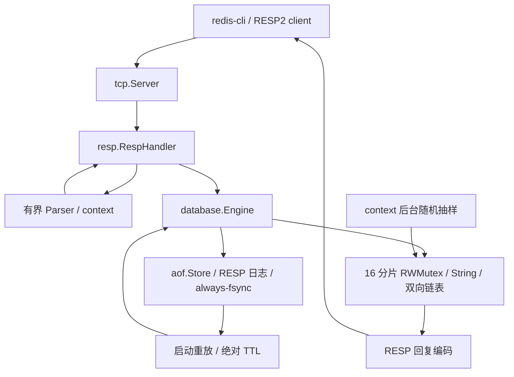

# Mini-Redis

[](https://github.com/Li-Nepenthe/mini-redis/actions/workflows/ci.yml)

用 Go 实现的 RESP2 子集单机内存数据库，用于学习网络、协议、并发和持久化的工程取舍。

## 当前状态

P1 的 S1–S5 工程验收完成；S6 的代码/Docker/停机与复审修复已通过，PR #1 已合并为 main@84d3c8c，合并后的 CI 全绿，默认首页已显示此项目文档。仍待仓库 description/topics 的可用写入口与本人七项口述，不能宣称个人学习封版。说明书 P2 在 [ai-backend/](ai-backend/README.md) 独立 Go module 推进，M1 业务地基已通过本机工程验收，M2–M5 待实施；逐项状态见 [验收矩阵](docs/acceptance-matrix.md)。

从 [中文学习指南](docs/learning-guide.md) 开始：运行 → 追踪一条请求 → 模块 → 测试/调试 → 练习与自查。阶段和实际命令/结果见 [开发记录](docs/notes.md)，进度表见执行说明书 §6。

## 快速开始

```sh
go run ./cmd/server -addr 127.0.0.1:6379 -aof data/appendonly.aof
redis-cli -p 6379
```

开发需 Go 1.26 或更高版本，当前支持 Windows/Linux。redis-cli 是官方 Redis 客户端。服务默认监听 `:6379`，示例使用本机地址；`-addr` 配置地址，`-aof ""` 关闭持久化。Ctrl+C/SIGTERM 先关 listener，关闭闲置连接、排空已开始的命令（2 秒网络预算），等待后台清理，再同步并关闭 AOF；不继续执行预读的流水线请求。极端执行器/磁盘阻塞不能靠 context 强行取消，超时会报告失败。本机对自有独立控制台进程发送真实 CTRL_C_EVENT，退出约 1.6–3.0ms，退出码 0，随后重开 AOF 恢复成功；这是自动信号验收，未模拟极端磁盘阻塞，也不构成每次退出耗时保证。

## 支持的命令

| 命令 | 语义 |
|---|---|
| `PING [message]` | 无参数返回 PONG，有参数返回二进制 bulk |
| `SET key value` | 保存 String，可覆盖 List；覆盖后清除原 TTL |
| `GET key` | 缺失或过期返回 nil；List 返回 WRONGTYPE |
| `DEL key [key ...]` | 删除存在且未过期的 key，重复 key 只计一次 |
| `EXISTS key [key ...]` | 统计存在且未过期的 key；重复参数重复计数 |
| `LPUSH key value [value ...]` | 按参数顺序依次插入头部，a b c 得到 c,b,a；保留已有 TTL |
| `LPOP key` | 弹出头部并保留 TTL；最后一个元素被弹出时删除 key 与 TTL |
| `LRANGE key start stop` | stop 包含在范围内；支持负下标，缺失返回空数组 |
| `EXPIRE key seconds` | key 不存在返回 0，成功返回 1；0 或负数立即删除；暂不支持 NX/XX/GT/LT |
| `TTL key` | 不存在/过期为 -2，无 TTL 为 -1；其余返回剩余秒数，按最近整秒取整 |

命令名不区分大小写，String/List 值保持二进制安全。参数错误返回 `ERR`，类型冲突返回 `WRONGTYPE`；内部错误链和原始协议错误不会回写客户端。

## 架构



## 设计取舍

1. 分片读写锁保留并发读能力，多 key 命令按固定分片顺序锁定；热点 key 仍受同一把锁约束；S5 实测该场景分片略慢，更多分片不能自动改善热点。
2. 惰性删除保证访问语义，后台每 250ms、每分片最多 256 次随机抽样回收冷 key。累计主动删除 32,768 个后，在分片锁外调用 debug.FreeOSMemory，两次至少间隔 5 秒，使空闲服务也有机会归还页；代价是全进程 GC/归还内存开销，回收不精确到期时刻。
3. AOF 采用先日志刷盘后改内存，写失败拒绝本次变更；每次 fsync 且持久化写入串行，换来清楚的确认边界，代价是吞吐与磁盘等待。

## 崩溃窗口

默认开启 AOF（Append Only File，顺序追加的操作日志）。`-aof ""` 关闭持久化。当前仅支持 Windows/Linux，文件由一个进程独占，路径所在目录必须可写。

写入顺序是 **校验 → 追加 RESP 日志 → fsync → 修改内存 → 回复**，只用 always-fsync 一种策略。依赖操作系统 fsync 成功的保证，已确认写入的应用层缓冲丢失窗口为 **0 秒**，代价是每条写入都等待磁盘。同步后、回复前崩溃时，未确认操作可能在重启后出现；重试非幂等 List 操作可能重复。

EXPIRE 记录绝对毫秒期限，重启不会延长 TTL。仅恢复尾部半条命令，完整坏记录拒绝启动。写入/同步失败会尝试回滚文件，保持本次内存改动未应用，并拒绝后续写入；同步和回滚同时失败时文件状态不确定，必须检查存储后重启。不能据此承诺硬件断电或文件系统损坏时绝对不丢数据。

## 性能数据

| 负载（ns/op 中位数；越小越好） | 单全局 RWMutex | 16 分片 | 64 分片 |
|---|---:|---:|---:|
| 读:写 = 9:1 | 386.90 | 58.11 | 34.70 |
| 纯写 | 361.60 | 109.60 | 68.48 |
| 80% 热点，读:写 = 1:1 | 381.70 | 394.30 | 405.80 |

Windows/amd64；AMD Ryzen 7 9700X（8 核/16 逻辑处理器）；CIM 可用物理内存 33,396,543,488 bytes（约 31.10 GiB）；Go 1.27.1；GOMAXPROCS=16，RunParallel 默认 16 个 worker。

10,000 key、64-byte value；无 AOF/TTL/TCP；每格三次中位数。热点场景更多分片反而略慢，因为同一 key 仍受同一把锁约束。命令、分配开销、原始输出与 CPU profile 分析见 [性能记录](docs/performance.md)。这些数值不能外推到磁盘持久化或网络服务。

## 已知限制

- 只接受 RESP2 数组/bulk 请求，最多 1024 参数、单 bulk 16 MiB、协议头 64 字节、单请求 32 MiB。
- EXPIRE 的正数秒数受 Go time.Duration 范围约束；过大或非法整数返回 ERR。暂不支持 SET 的 EX/PX/NX/XX 等选项。
- 无认证、TLS、连接总数/数据总量配额。仅面向学习与受控本机环境。
- 大批过期会触发受频率限制的主动 GC；本机 10 万 key、256-byte value、5 秒 TTL、无 AOF/后续读取时，工作集在 15 秒内从 82,616,320 降到 25,841,664 bytes。map/slice 容量仍可保留，不保证回到启动内存或相同回落比例；S5 基准未运行清理，不包含这项 GC 的请求延迟成本。
- 学习客户端 `cmd/client` 的显示能力未扩展，不能作为完整命令兼容性验收工具。
- Cluster、复制、事务、Lua、Pub/Sub、其他数据结构和 AOF Rewrite 不在本项目范围。

## 本地检查与容器

```sh
go test ./... -count=1 -timeout=60s
go vet ./...
go build ./...
gofmt -l .
```

已安装 Staticcheck 时运行 `staticcheck ./...`。支持的 C 工具链下运行 `go test -race ./... -count=1 -timeout=180s`；经使用者明确同意，仅在项目子进程使用已有便携 GCC，内存修复后的全量 race 已通过，没有更改系统编译器配置。解析器长期回归：`go test ./resp -fuzz=FuzzParseStream -fuzztime=10m -parallel=2`。

已有 Docker daemon 和官方客户端时：

```sh
docker build -t mini-redis:local .
docker run --rm --name mini-redis-local -p 127.0.0.1:6379:6379 -v mini-redis-data:/data mini-redis:local
```

多阶段构建将 Go 1.27.1 编译的 Linux 可执行文件放入 scratch 镜像，以非 root 用户运行；命名卷保存 AOF。官方客户端可运行 `docker run --rm --network container:mini-redis-local redis:alpine redis-cli -h 127.0.0.1 -p 6379 PING`。停止用 `docker stop --time 3 mini-redis-local`。本轮启动已有 Docker Desktop 29.7.2，Docker 构建/运行与官方 redis-cli 8.10.2 验收通过。容器内 SIGKILL 后命名卷恢复 String/List、绝对 TTL 未续命；SIGTERM 正常停止约 0.294s、退出码 0，AOF 重开成功。临时验收容器和数据卷已清理。GitHub Actions 的 race/vet/Staticcheck/build/格式已在 [草稿 PR #1](https://github.com/Li-Nepenthe/mini-redis/pull/1) 上通过，实测来源见 [CI 运行](https://github.com/Li-Nepenthe/mini-redis/actions/runs/36974612279)。PR #1 已合并，main@84d3c8c 的 [CI](https://github.com/Li-Nepenthe/mini-redis/actions/runs/36991251698) 全步骤通过；默认仓库页面已实测显示项目 README。仓库元信息和本人口述仍待完成。

## 未来方向

封版后只在这里记录想法，不自动实施；本轮仍按说明书完成既定阶段，不追加范围外功能。


### AOF 历史 TTL 与新建边界

重放全部历史写入期间不以重启时间提前删键，避免过期前追加的 List 永久复活、续期后的 String 丢失。新建 List 的持久化命令为内部 _LNEW（网络不开放），明确清除旧值/TTL；重放结束后普通访问与清理 worker 按当前时间删除最终过期键。EXPIRE 仍使用绝对 __EXPIREATMS，未增加网络命令或 AOF Rewrite。

旧草稿版本的 SET/LPUSH/LPOP/DEL/绝对过期记录仍可读取。旧日志没有记录“过期后 LPUSH 创建新 List”的边界，无法事后区分该情况和过期前追加；这类旧数据应先保留原文件并人工核对，不能声称能无损推断。新的日志记录解决该歧义。
