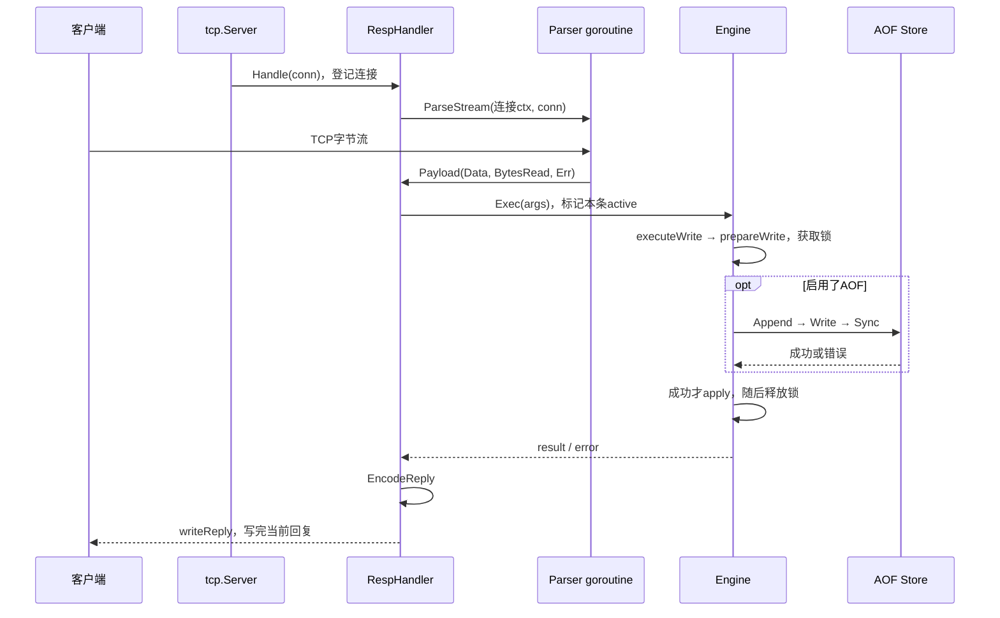

# Mini-Redis：从零到一的 P1 学习教程与实验指南

对照当前 main 的 P1 实现：十条命令、String/List、16 分片、TTL 双策略、always-fsync AOF、连接回收与停机。P1 修复 fbbce11 已通过复审并合并；P2 M1 也已合并。用户于 2026-10-02 要求暂停第二阶段，学习重点回到 P1；本地 Provider 适配器不是完整 M2。

工程通过和本人学会是两项验收。说明书 S6 七项脱稿讲解、三分钟/十五分钟项目介绍仍需自己完成，description/topics 尚待可用写入口。实际结果见 [开发记录](https://github.com/Li-Nepenthe/mini-redis/blob/main/docs/notes.md)，逐项状态见 [验收矩阵](https://github.com/Li-Nepenthe/mini-redis/blob/main/docs/acceptance-matrix.md)。本文只完善教学和设计备注，不增加应用功能。

## 从零学习的正文导航

本次不把行数当作完成标准。以下十章提供逐步推理与实验，本页保留调用速查和原样复现实验。按一章一章顺序学习，不同时要求完成所有模块。顺序是**模拟从零构建的教学依赖**，不是伪造 Git 历史。全部问题的完整答案、判断依据、常见错误和纠偏均在第9章；工程通过不等于本人学会。

| 次序 | 正文 | 本步产物 |
|---|---|---|
| 0 | [问题、学习价值与最少基础](tutorial/00-purpose-and-foundations.md) | 区分Go基础/协议/项目约束，包职责 |
| 1 | [空目录起步与依赖顺序](tutorial/01-start-from-empty.md) | 独立学习工程、第一次精确输出 |
| 2 | [协议与完整请求](tutorial/02-protocol-and-request.md) | 27+20字节、三字节Read实验、回复分类 |
| 3 | [Engine与命令](tutorial/03-engine-and-commands.md) | List小数据、五返回协作、业务→RESP实验 |
| 4 | [并发与锁](tutorial/04-concurrency.md) | 反序死锁推导、路由、六元素并发实验 |
| 5 | [TTL与内存](tutorial/05-ttl-and-memory.md) | 固定时间/索引推导、层次与失败定位 |
| 6 | [AOF与历史恢复](tutorial/06-aof-and-recovery.md) | 五个失败点、历史TTL、真实半尾实验 |
| 7 | [网络与生命周期](tutorial/07-lifecycle.md) | 资源交接、取消/关闭/等待、停机故障检查 |
| 8 | [验证与故障证据](tutorial/08-verification.md) | 测试模型、fuzz/benchmark/CI的证明范围 |
| 9 | [32题完整答案与讲解示范](tutorial/09-answers.md) | 逐题答案/依据/常错/纠偏，S6七点与3/15分钟 |

配套：[主题→源码→实例→实验→题答矩阵](teaching-coverage.md)、[全部包/函数注释审计](comment-coverage.md)。第一阶段包含平台实现、未导出函数、测试/fake、fuzz和benchmark；第二阶段继续暂停。

## 1. 做这个项目要学到什么

网络收到的不是“一个 SET”，而是一串可能分批到达的字节；几个连接可能同时改一个 List；数据已经告诉客户端成功，进程却可能马上崩溃；键过期了，操作系统看到的内存却可能没有下降。学习意义是将这些现象推导成接口、状态约束、失败边界和可执行验证，而不是背命令或技术名词。

读完应能：

- 画出 SET/GET 的路径，指出解析、校验、锁、刷盘和回复各在哪一层。
- 说明关键函数的输入/输出、共享状态、资源归属、成功与失败边界。
- 用反例解释 WHY：错误方案的后果、当前选择的代价、替代方案改变的承诺。
- 区分功能测试、race、Fuzz、Benchmark、进程实验的证据范围。

这里只兼容 RESP2 子集。按说明书，P1 不做 AOF Rewrite、复制、Cluster、Sentinel、事务、Lua、Pub/Sub、RDB、其他数据结构或客户端增强。可以解释真实 Redis 为何需要它们，不安排为新功能。

### Go 术语先解释

| 术语 | 在本项目里的含义 |
|---|---|
| `[]byte` / `[][]byte` | 字节切片 / 一组参数字节；SET、key、value各一项，不是JSON |
| 帧、CRLF、bulk | 协议消息边界、`\r\n`两字节、长度在前的二进制数据 |
| goroutine | Go并发执行的函数；每连接有Handler和另起的Parser，都要回收 |
| channel | 交付Payload的通道；无人接收时发送可能阻塞 |
| context | 协作取消/截止信号，不会自动杀goroutine或打断任意Reader |
| Mutex / RWMutex | 互斥锁/读写锁；保护共享状态，多个读者可并行、写者独占 |
| defer / 闭包 | 返回时清理（后注册先执行）/捕获外层状态的函数 |
| interface / any | 接口规定方法；any是可容纳任意Go值的空接口，读取时仍须检查实际类型 |
| 类型断言 | `value, ok := raw.([]byte)`检查接口内是否是该类型，不是自动转换；失败ok=false |
| WaitGroup / Once | Add登记、Done完成、Wait等计数归零 / Do只执行一次动作，不会自动关闭资源 |
| TTL / 期限 | 剩余生存时间/绝对到期时刻；重启不能把两者混用 |
| AOF / 重放 | 追加写操作日志/启动时依次应用日志恢复状态 |
| fsync（Sync） | 请求操作系统同步文件；成功才越过本项目的持久化确认边界 |
| GC / 工作集 | Go垃圾回收/Windows进程当前驻留物理内存；不是同一指标 |

Go接口按方法集隐式满足，不写Java式implements。`CommandExecutor`要求`Exec([][]byte) (any, error)`，`*Engine`有这个方法就能交给Handler；测试可传慢执行器而不用复制业务。`map[string]any`让同一存储容纳String的`[]byte`和List的`*LinkedList`，GET通过带ok的类型断言区分；存在却不是String返回WRONGTYPE，不是把List硬转换成字节。无ok的错误断言会panic。`func (e *Engine) Exec…`里的e是方法接收者，表示它操作哪一个Engine实例。

## 2. 每次只学习当前一轮

先完成第一轮检查点，再进入下一轮。下面是阅读顺序，不是同时要求完成六个模块。

| 轮次 | 目标与入口 | 验证入口 | 本轮完成特征 |
|---|---|---|---|
| 1：命令 | §3、[engine.go](https://github.com/Li-Nepenthe/mini-redis/blob/main/database/engine.go) Exec、[reply.go](https://github.com/Li-Nepenthe/mini-redis/blob/main/resp/reply.go) | CommandSequence / CommandReplyEncoding | 不看代码预测输出 |
| 2：协议 | §4–5、[parser.go](https://github.com/Li-Nepenthe/mini-redis/blob/main/resp/parser.go)、[handler.go](https://github.com/Li-Nepenthe/mini-redis/blob/main/resp/handler.go) | ParserFragmentedInput / ParserMultipleCommands | 画一帧，解释半包/粘包/预算 |
| 3：并发 | §6、engine.go、[persistence.go](https://github.com/Li-Nepenthe/mini-redis/blob/main/database/persistence.go) | EngineOwnsStoredAndReturnedBytes / ConcurrentListAndMultiKeyCommands | 指出锁覆盖区间，解释拷贝与死锁 |
| 4：TTL | §7、[ttl.go](https://github.com/Li-Nepenthe/mini-redis/blob/main/database/ttl.go) | TTLSemantics / 两个内存案例测试 | 区分不可见、删引用、GC、归还页 |
| 5：AOF | §8、[store.go](https://github.com/Li-Nepenthe/mini-redis/blob/main/aof/store.go) | 历史TTL/半尾/刷盘失败 | 解释确认前缀与历史时间 |
| 6：生命周期 | §9–10、[server.go](https://github.com/Li-Nepenthe/mini-redis/blob/main/tcp/server.go)、[main.go](https://github.com/Li-Nepenthe/mini-redis/blob/main/cmd/server/main.go) | Shutdown / Benchmark / CI | 为资源找到启动者、停止动作和等待点 |

当前只安排第一轮：所属P1学习复核，核心必做；目标是建立命令到回复的直觉，防止只背接口。前置知识是字节、类型、TTL。输入为客户端命令、输出为RESP回复；约束是专用学习文件、已有十条命令和String/List。步骤为启动→预测§3输出→运行→对照Exec/EncodeReply；不新增主体代码。已有TestCommandSequence和TestCommandReplyEncoding提供验证。常见错误是读反LPUSH顺序、混淆空值/不存在、以为SET保留TTL。验收时合上代码回答：值在哪变成字节、在哪改类型、在哪变成+OK？

## 3. 先运行，再预测结果

在根目录运行P1；根go.mod要求Go≥1.26，本次验证用1.27.1。ai-backend/是独立module，根`go test ./...`不会测试它。

```powershell
go version
go run ./cmd/server -addr 127.0.0.1:6380 -aof data/learning-p1.aof
```

专用学习文件若已存在，会恢复之前的数据。另开终端运行已有官方`redis-cli -h 127.0.0.1 -p 6380`；端口占用时选择其他空闲端口并同步修改客户端。示例绑定本机；本项目无认证/加密，不用于公网部署。

客户端依次输入：

```text
PING
set study:s hello
GET study:s
TTL study:s
EXPIRE study:s 60
SET study:s newer
TTL study:s
DEL study:list
LPUSH study:list a b c
LRANGE study:list 0 -1
LRANGE study:list -2 -1
LPOP study:list
SET study:list text
LPUSH study:list x
EXISTS study:s study:s
DEL study:s study:s
```

关键预期：PING→PONG，SET→OK，GET→hello；永久TTL=-1，EXPIRE成功1，SET覆盖并清TTL，所以下一次TTL=-1。新List长度3，全部为c,b,a，末两项b,a；LPOP得到c。SET将List覆盖为String，之后LPUSH返回WRONGTYPE。EXISTS按参数计数，相同存在key两次返回2；DEL按实际删除去重，返回1。GET不存在是nil，空字符串是存在且长度0的值。

无系统客户端但已有Docker，可尝试官方容器客户端：

```powershell
docker run --rm -it redis:alpine redis-cli -h host.docker.internal -p 6380
```

Docker宿主网络是否允许访问本机监听要实际确认；镜像能启动不等于网络通过。无需安装客户端也能学习这些现有测试：

```powershell
go test ./database -run='TestCommand|TestList|TestEngineOwns' -count=1 -v
go test ./resp -run=TestCommandReplyEncoding -count=1 -v
go test ./tcp -run=TestTwentyCommandsOnOneConnection -count=1 -v
```

## 4. 一条 SET 的真实调用链

`SET study:k hi`的线上字节如下；`\r\n`是转义显示，实际发送两个字节：

```text
*3\r\n$3\r\nSET\r\n$7\r\nstudy:k\r\n$2\r\nhi\r\n
```

`*3`是三个参数，`$7`是下一个参数七字节。中文“你好”UTF-8为六字节；长度让内容中的CRLF不被误认作帧结束。[RESP官方规范](https://redis.io/docs/latest/develop/reference/protocol-spec/)解释了数组请求与bulk的二进制安全。



1. main.run先占端口、创建Engine；AOF重放后AttachLog，才启动清理和Serve，恢复未完成时不处理业务请求。
2. Server.Serve接受连接、登记WaitGroup，启动Handler。
3. Handler登记状态并启动Parser；后者连续读帧，通过无缓冲channel交付Payload。
4. Handler同锁检查停机并标active，调用Exec。只将命令名转大写，key/value保持原字节。
5. SET进入executeWrite；有AOF先拿全局写顺序锁。prepareWrite校验参数、拿shard写锁、处理到期旧值，准备record和apply。
6. Store.Append完整Write后Sync，错误时不apply。成功后apply清TTL、保存复制的value，离函数时释放锁。
7. SET结果true，EncodeReply编成`+OK\r\n`；writeReply循环处理短写，回复写完后才清active。

GET支路：`Exec → get → lockRead → 查询/类型校验/复制 → RUnlock → EncodeReply → writeReply`，不写AOF。通常只持读锁；发现过期时释放读锁、取写锁重检删除，所以“读命令”不意味着整个过程绝不修改状态。

### 函数契约：协议与生命周期

| 函数/文件 | 输入→输出 | 状态/资源/锁边界 | WHY |
|---|---|---|---|
| Server.Serve，server.go | listener→error | 管接收循环，closed/wg.Add同锁；连接交给Handler | listener关闭与当前命令结束不同 |
| Handler.Handle，handler.go | conn→无返回 | 管conns/active，拥有连接及Parser取消/关闭/等待 | 业务失败也必须收回Parser |
| Parser.ParseStream，parser.go | ctx、Reader→Payload通道 | 每次起goroutine，由生产者关channel；不关闭Reader | TCP与AOF共用Parser，资源归调用者 |
| readHeader/readRequest，parser.go | bufio→头/参数/实际大小/error | 无业务map，预算先于bulk分配，区分EOF/半帧 | 业务不猜网络分片 |
| EncodeReply，reply.go | any、错误→字节/error | 不改Engine，公开错误白名单/CRLF清理 | 编码可独立测，cause不泄露 |
| writeReply，handler.go | conn、字节→error | 循环Write，无数据库锁 | 短写处理，慢客户端不一直占Engine锁 |

### 函数契约：存储与日志

| 函数/文件 | 输入→输出 | 状态/锁边界 | 必须解释的WHY |
|---|---|---|---|
| NewEngine/getShard，engine.go | 数量/key→Engine/shard | 初始化私有map；路由无锁，访问map才锁 | 2的幂掩码，稳定路由不解决热点 |
| Engine.Exec，engine.go | 参数→any,error | 分发，不统一给所有命令加一把锁 | 协议/业务/持久化可各自验证 |
| lockKeys，engine.go | keys、write→unlock闭包 | 去重排序，返回时仍持锁，调用者defer | 相反参数顺序不能形成锁环 |
| get/lrange，engine.go | 参数→复制值/error | lockRead返回RLock，复制完再解锁 | 返回结果不共享内部可变字节 |
| LinkedList.LPush/LPop，engine.go | 字节→无返回 / 无输入→(字节,bool) | 自身无锁，由shard写锁保护；LPush复制 | 原子性在命令边界，避免两套锁 |
| lockRead，ttl.go | key→shard、now | 返回持RLock；过期先放读锁再写锁重检 | RWMutex不能升级，窗口内可能续期 |
| setExpiration/clearExpiration，ttl.go | key、期限/key→无返回 | 调用者持写锁，同步expires/expiring/index | O(1)抽样/删除，续期不重复入池 |
| RunCleanup/cleanupExpired，ttl.go | ctx/无输入→退出/删除数 | 一个worker，每shard最多256检查，回收在锁外 | 清冷数据但不长时间霸占请求锁 |
| executeWrite，persistence.go | args、cmd→结果/error | logMu→有序shard→Store.mu；apply仍持shard锁 | 日志顺序=内存顺序，失败值不公开 |
| prepareWrite，persistence.go | args、cmd、replay→result/record/apply/unlock/err | 返回仍可能持写锁；错误路径也unlock | 检查和应用分开，Append失败不提交 |
| Replay/AttachLog，persistence.go | 记录/日志→error/绑定 | 启动顺序重放，不Append，之后绑日志/开worker | 历史不能按现在提前删，恢复不重复追加 |
| aof.Open，store.go | ctx、路径、回调→Store/error | 独占文件锁，失败收句柄，成功交给Store | 单写者/修尾偏移来自实际消费 |
| Append/fail/Close，store.go | record/error/无输入→error | Store.mu，size为确认前缀，失败粘住，Close同锁 | 失败后不能继续报成功，关闭不与写交错 |

`any`容纳不同Go结果，不是任意JSON。nil→`$-1\r\n`，空`[]byte`→`$0\r\n\r\n`，空`[][]byte`→`*0\r\n`，StatusReply(PONG)/true→状态行PONG/OK，int/int64→整数行，公开commandError→ERR/WRONGTYPE；未知内部错误只给internal server error。

## 5. 为什么 Parser 不能“一次 Read，一条命令”

TCP是有序字节流，不保留发送边界。一帧可分批到达，多帧可一次读到。readRequest先读数字头，再用[io.ReadFull](https://pkg.go.dev/io#ReadFull)凑够内容与CRLF；ParseStream循环读下一帧。bufio保留未消费字节。

| 错误方案 | 后果/当前边界 |
|---|---|
| 一次Read按一条请求处理 | 半包少参数、粘包错位；按协议长度处理 |
| bulk用换行切分 | 值允许CRLF，会截断；内容按字节数读取 |
| 无界ReadBytes等头换行 | 恶意无换行会扩容；固定缓冲ReadSlice+64-byte头预算 |
| make后才判断长度 | 负数panic/先消耗巨量资源；分配前判断 |
| 只限单bulk16MiB | 1024项累计仍巨大；整帧32MiB且下次分配前检查剩余预算 |
| 半帧EOF当干净结束 | 无法区分断帧，AOF无法安全修尾；保留不完整错误 |

干净EOF是在新帧尚未开始时到尾；开始后不足是半帧。BytesRead为本帧实际头+内容+CRLF，不是预读量。限制是每帧预算，尚无全服务器内存/连接配额，不把Fuzz通过夸大成所有资源攻击都解决。

```powershell
go test ./resp -run='TestParserFragmentedInput|TestParserMultipleCommands|TestParserIncompleteCommandIsNotCleanEOF|TestParserRequestByteBudget' -count=1 -v
```

预期PASS。纸上将SET任意切成两段、再拼两帧，标注ReadFull需要的字节，不要求增强客户端。

## 6. 为什么锁、拷贝和链表要一起看

### 分片、顺序与确认

`fnv32(key)&(N-1)`稳定路由。这里FNV-1是先乘后异或，不是FNV-1a、安全散列或热点均摊。N=16掩码15；非2的幂位与会漏分片，NewEngine拒绝非法N。取模可支持其他N，但改变当前约束。

shard.mu共同保护data、expires、expiring及List节点；只锁map查找而放开节点修改仍竞争。EXISTS也可能惰性删除，所以当前多key使用写锁，较保守但命令内状态一致。

死锁反例：A先锁3再7，B先7再3，互等。lockKeys排序获取并去重；不去重可能第二次等待自己持有的不可重入写锁。返回unlock闭包让调用者defer覆盖所有路径，逆序释放。

AOF模式锁顺序`logMu→排序shard→Store.mu`，不同shard写也按统一日志顺序提交。读不拿logMu，但同shard读会等待fsync。把Append挪到解锁后可能使日志与内存顺序不同，不是直接删锁的优化。

### 数据所有权

切片赋值共享底层数组。SET/LPush复制输入，GET/LRANGE复制输出；否则调用者修改参数或离锁后修改回复会暗改数据库。LPop将节点移出List，返回值不再保存在活节点中，所有权随弹出转移。

复制付出内存/CPU，换取“锁内共享状态、锁外独立结果”的边界。零拷贝需要新的不可变/生命周期契约，不能只删Clone。

### List 选择与代价

LPush改head/prev，首节点也成为tail；LPop移head，最后弹出后head/tail为空。多值逐项压头，a b c得到c b a。头插/弹出O(1)，但指针/节点分配有成本；LRANGE遍历到start并复制，不是O(1)随机访问。切片连续内存有定位优势，头插可能移动元素；理解负载取舍，不新增结构。

List自身无锁，所属shard覆盖整条命令，避免额外锁顺序。读锁不能原地升级；[RWMutex官方契约](https://pkg.go.dev/sync#RWMutex)明确这个限制。

```powershell
go test ./database -run='TestEngineOwnsStoredAndReturnedBytes|TestConcurrentListAndMultiKeyCommands|TestListRangeBoundaries' -count=1 -v
```

预期PASS。读测试怎样修改输入/返回值而原值不变，怎样约束并发结果；race检测实际执行的竞争，不替代死锁推理。

## 7. TTL：不可见、删引用与归还内存是三件事

### 7.1 语义与数据结构

每shard有data、`expires[key]={deadline,index}`、`expiring[index]=key`。永久key不进抽样池；续期只改deadline，不重复入池。clearExpiration用末项补洞并更新movedKey.index，删除O(1)；清空旧末项避免底层数组继续引用key，不要求保持顺序。

| 操作 | 当前语义 |
|---|---|
| 不存在/已过期，TTL | -2 |
| 存在但永久，TTL | -1 |
| 存活且有期限，TTL | 剩余秒数近似四舍五入；不到半秒可为0，0不代表已不存在 |
| EXPIRE不存在 | 0 |
| EXPIRE存在且秒数≤0 | 立即删，返回1 |
| SET覆盖 | 覆盖类型，清TTL |
| 存活List的LPUSH/LPOP | 保留TTL；弹空后删key/TTL |
| 过期key再LPUSH | 新List，没有旧值/旧TTL |

lockRead成功返回仍持RLock。过期时不能在读锁下删，也不能持RLock直接Lock；当前先放读锁、取写锁、按新的时间重检。释放窗口中其他连接可能续期/SET，沿用旧判断会误删新状态。

惰性删除保证访问时不可见；主动清理释放不再访问的冷key。每250ms对每shard最多随机检查256次，随后放锁；expiring支持O(1)取样。不是每tick全表扫描，也不保证每个冷key在固定tick立即物理删除。

每key一个定时器增加定时任务与续期/取消管理；全表持锁扫描阻塞请求。当前单worker、有界工作量换来较低生命周期复杂度，代价是清理滞后、采样/锁切换成本。

```powershell
go test ./database -run='TestTTLSemantics|TestExpiredKeysAreMissingForEveryCommand|TestListKeepsTTLAndExpiryIndexIsConsistent' -count=1 -v
```

预期PASS。clockEngine注入时钟，使边界可重复，不靠手工刚好赶上某秒。

### 7.2 真实案例：已经删除，为什么工作集还高

首次独立进程写10万个256-byte value、TTL5秒，无AOF、后续不GET；业务清理已发生，约85.8MB工作集却在30秒内几乎没变。不能直接推出“还有10万key”：删除引用后GC可能未及时运行，收集后运行时也可能保留页，map/切片容量也可保留。

| 指标/动作 | 能说明 | 不能说明 |
|---|---|---|
| shard key数为0 | 主动删除完成 | 驻留内存已归还 |
| HeapAlloc下降 | Go活跃分配减少 | 工作集等比例下降/map容量缩小 |
| WorkingSet64下降 | 进程驻留物理内存减少 | 一定回到启动值/没有GC成本 |
| 测试外部runtime.GC | 对象可被收集 | 无读取/外部GC的真实服务自动回落 |

最终worker**实际累计删除32768个key**、且距上次回收至少5秒，才在所有shard锁外debug.FreeOSMemory。它强制GC并尝试归还页，[官方说明](https://pkg.go.dev/runtime/debug#FreeOSMemory)不保证回到指定值。不是每tick GC或每key到期GC。

修复后同类独立进程：82,616,320→25,841,664 bytes（写完15秒）→25,829,376（30秒），约降69%，未回到启动约6.8MB。全局GC/归还页有CPU/暂停成本；锁外减少额外shard阻塞，不代表没有全局暂停。大量过期P99尚未测，普通命令基准不能证明没有代价。

```powershell
go test ./database -run='TestExpireHundredThousandKeysWithoutReads|TestLargeExpirationReclaimsOutsideShardLocks' -count=1 -timeout=60s -v
```

前者确认主动删除全部key，并在测试里GC前后量HeapAlloc；它**不是OS工作集验收**。后者注入reclaim，确认所有shard可TryLock、worker可取消；验证锁边界，不测真实GC内存。

### 7.3 可选深入：Windows独立进程，不GET、不外部GC

使用现有服务与Python标准库，专用端口6381、临时二进制；记录自己的曲线，不要求复制历史数字。将下段保存为临时文件`mini-redis-study-fill.py`，它只写入：

```python
import socket
import sys
import time

port = int(sys.argv[1])
def frame(*parts):
    return (b"*" + str(len(parts)).encode() + b"\r\n" +
            b"".join(b"$" + str(len(p)).encode() + b"\r\n" +
                     p + b"\r\n" for p in parts))

started = time.monotonic()
with socket.create_connection(("127.0.0.1", port), timeout=10) as conn:
    conn.settimeout(30)
    with conn.makefile("rb") as reply:
        for start in range(0, 100000, 1000):
            packet = []
            for i in range(start, start + 1000):
                key = ("study:mem:" + str(i)).encode()
                packet.append(frame(b"SET", key, b"x" * 256))
                packet.append(frame(b"EXPIRE", key, b"5"))
            conn.sendall(b"".join(packet))
            for _ in range(1000):
                if reply.readline() != b"+OK\r\n":
                    raise RuntimeError("SET was not acknowledged")
                if reply.readline() != b":1\r\n":
                    raise RuntimeError("EXPIRE was not acknowledged")
print("100000 keys; write seconds:", round(time.monotonic()-started, 3))
```

在仓库根目录执行PowerShell，将python文件路径替换成你保存的位置。最后仅停止它自己启动的无AOF实验进程：

```powershell
$studyDir = Join-Path $env:TEMP ('mini-redis-study-' + [guid]::NewGuid().ToString('N'))
New-Item -ItemType Directory -Path $studyDir | Out-Null
$studyExe = Join-Path $studyDir 'mini-redis-study.exe'
go build -o $studyExe ./cmd/server
if ($LASTEXITCODE -ne 0) { throw 'build failed' }
$studyProcess = Start-Process -FilePath $studyExe -ArgumentList '-addr=127.0.0.1:6381','-aof=' -PassThru -WindowStyle Hidden -RedirectStandardOutput (Join-Path $studyDir 'stdout.txt') -RedirectStandardError (Join-Path $studyDir 'stderr.txt')
try {
    Start-Sleep -Milliseconds 500
    $studyProcess.Refresh()
    if ($studyProcess.HasExited) { throw 'server failed; read stderr.txt (possibly port occupied)' }
    python .\mini-redis-study-fill.py 6381
    if ($LASTEXITCODE -ne 0) { throw 'write experiment failed' }
    $studyProcess.Refresh()
    [pscustomobject]@{ At='after writes'; PID=$studyProcess.Id; WorkingSet=$studyProcess.WorkingSet64; Peak=$studyProcess.PeakWorkingSet64 }
    foreach ($sample in 15,30) {
        Start-Sleep -Seconds 15
        $studyProcess.Refresh()
        [pscustomobject]@{ At=("$sample seconds"); PID=$studyProcess.Id; WorkingSet=$studyProcess.WorkingSet64; Peak=$studyProcess.PeakWorkingSet64 }
    }
} finally {
    $studyProcess.Refresh()
    if (-not $studyProcess.HasExited) { Stop-Process -Id $studyProcess.Id }
}
```

预期写入确认成功，当前实现大批回收通常使工作集明显回落；Peak仍记录历史最大值，不能判断“现在占多少”。写入若超过5秒，早期key可能已到期，需记录写入耗时；机器负载/版本会改变曲线。采样不GET、不重启、不外部GC；强制清理不是优雅停机验收，不停止其他PID。

## 8. AOF：先确认边界，再理解历史时间

### 8.1 检查、Append、apply为何分开

当前always-fsync：`校验/准备→Append→完整Write→Sync→apply内存→回复`。prepareWrite持锁检查类型/参数/状态，返回未来apply；错误或无效果写入不追加。准备阶段可能惰性清理已到期旧值，这不是新业务写入成功。

| 出错位置/错误方案 | 后果与处理 |
|---|---|
| 错参数/类型却先Append | 日志含无效记录，当前先校验 |
| 先改内存，Sync失败 | 未确认新值已被读到，当前不apply |
| Sync成功、apply前崩溃 | 日志可能有客户端未收到确认的操作 |
| 提交成功、回复断连 | 客户端不确定成功；未确认不等于没发生 |
| 半写/Sync失败后继续成功 | 坏前缀后继续追加；当前尽力回滚并粘住失败 |

Store.size只在Write+Sync成功后增加。fail尽力Truncate+Sync回到旧size，即使回滚成功仍拒绝后续写；回滚失败组合保存错误，不冒充自动修复。网络只给公开persistence write failed，cause留给errors.Is/内部日志。

每写Sync降低确认写的崩溃窗口，却有磁盘与持锁成本。周期fsync可增吞吐，但必须改变确认窗口、缓冲/关闭约束；这里只实现一种。依赖OS/存储正确履行同步，不承诺所有硬件断电场景。

### 错误文本不是错误身份

cause是底层原因，commandError.Unwrap返回它；`fmt.Errorf("位置: %w", err)`用%w保留可遍历的原因链，%v只有文本。errors.Is沿链判断是否匹配某个错误值（也支持错误自定义匹配），不是比较Error()字符串；errors.As沿链找到指定类型/接口，取出它用于处理。内部原因可识别，与是否公开给客户端是两项设计。

下面是调用片段，放入Go程序时需导入errors、fmt及仓库database/resp包；不是新的服务功能：

```go
e := database.NewEngine(16)
_, err := e.Exec([][]byte{[]byte("SET"), []byte("k")}) // 缺少value
wrapped := fmt.Errorf("request failed: %w", err)
fmt.Println(errors.Is(wrapped, database.ErrWrongArgsNum)) // true
var public interface{ RESPError() (string, string) }
fmt.Println(errors.As(wrapped, &public)) // true，找到公开错误接口
reply, _ := resp.EncodeReply(nil, wrapped)
fmt.Printf("%q\n", reply) // "-ERR wrong number of arguments for 'set' command\r\n"
```

这里wrongArgs保留ErrWrongArgsNum作cause；EncodeReply使用As识别公开RESPError，输出不会含“request failed”或底层路径。随便errors.New同样的文字不具有这个哨兵错误身份；直接输出err.Error既不提供可靠分类，又可能泄漏内部链。

### 8.2 半尾与完整坏记录不能一视同仁

Open按Payload.BytesRead累计最后完整偏移。bufio会预读，file当前游标不等于已重放位置；合法`$03`与重新编码`$3`长度不同，也不能替代真实偏移。

最后一条确实不完整可截掉并Sync；完整非法帧/命令报错保留原文件，不自动删后续内容，否则可能静默丢确认记录。独占锁禁止第二个进程同时追加/修尾；Windows追加模式句柄不能用于当前截断恢复，所以O_RDWR后定位顺序写。

```powershell
go test ./aof -run='TestRecoverOnlyIncompleteTailWithActualOffsets|TestRejectCorruptOrInvalidCompleteRecordsWithoutTruncating|TestWriteAndSyncFailuresAreSticky|TestAOFExclusiveLock' -count=1 -v
go test ./database -run='TestPersistenceFailureDoesNotMutateMemory|TestInvalidAndNoOpWritesDoNotAppend' -count=1 -v
```

预期PASS，临时文件/故障logFile验证，不截你的真实或学习AOF。

### 8.3 真实案例：绝对期限正确，回放仍会错

EXPIRE10记录私有`__EXPIREATMS key 绝对毫秒期限`，不从重启时“再活10秒”。但还需区分历史当时状态与重启当前时间。

**故障A：已到期List复活**

| 时刻 | 真实历史 | 错误回放（重启t=6） |
|---|---|---|
| t=0 | LPUSH k a，EXPIRE5 | 创建List、期限5 |
| t=1 | LPUSH k b，当时未过期，仍有期限5 | 若按当前6提前删，再LPUSH b就成无TTL新List |
| t=6 | 应全部过期不可见 | TTL=-1/List=[b]，错误复活 |

**故障B：续期String丢失**

| 时刻 | 真实历史 | 错误提前删除 |
|---|---|---|
| t=0 | SET k v、EXPIRE5→deadline5 | 重启6读期限5就删值 |
| t=4 | EXPIRE10→deadline14 | 后续期限14无法恢复已经删掉的值 |
| t=6 | GET=v、TTL约8 | GET=nil，丢仍存活的值 |

修复两处：Replay设置期限不按现在删历史值；prepareWrite(replay=true)跳过普通写的当前过期检查。先还原全部历史，再由普通访问/worker判断最终期限；Replay不Append，恢复不重复写。

**仅延迟删除为何还不够？** 过期清理不写AOF。旧List/String已过期，t=6真实LPUSH应新建；日志若仍只LPUSH，延迟删除后会混旧值，或对旧String产生WRONGTYPE。

因此真实LPUSH发现缺失/过期key时记录`_LNEW`：Replay清旧类型/TTL、新建List；存活List仍普通LPUSH保留TTL。与LPUSH同为5字节、参数数相同，不把合法最大32MiB帧撑过预算；不是扩大Parser上限。私有命令只能Replay，网络Exec拒绝。

```powershell
go test ./database -run='TestReplayPreservesHistoricalExpiryAndCreation|TestLegacyReplayKeepsExpiryUntilFinalState|TestReplayExpirationUsesAbsoluteDeadline' -count=1 -v
go test ./aof -run='TestExpiredListWithLaterPushDoesNotResurrectOnReopen|TestMaximumSizedLPUSHFitsPersistedCreationRecord' -count=1 -timeout=60s -v
```

预期PASS。第一项含expired-list、renewed-string、recreated-list、expired-string-to-list、cleaned-list，同一最终时刻对比原/重放引擎TTL/GET/LRANGE并确认不再Append。LegacyReplay期待v/TTL8；最大帧检查内部编码不扩大预算。

用§3专用服务手工验证（LPUSH b须在10秒内完成）：

```powershell
redis-cli -p 6380 DEL study:replay
redis-cli -p 6380 LPUSH study:replay a
redis-cli -p 6380 EXPIRE study:replay 10
redis-cli -p 6380 LPUSH study:replay b
Start-Sleep -Seconds 11
```

服务窗口Ctrl+C，原命令重启**同一个学习文件**；TTL应-2，LRANGE为空。精确续期边界用固定时钟测试，不把旧错误逻辑恢复进真实仓库。

早期草稿AOF缺“过期后重建”边界时信息不足，不能反推全部历史；普通旧格式可读不等于歧义可修。没有自动重写/替换旧日志。追加日志增长、启动变慢解释真实Redis为何需要Rewrite，但按说明书不实现。

**自查**：t=6回放t=0期限，“已过期就删”为何错？回答要包含后面可能续期与过期后重建仍需_LNEW，只说绝对时间不够。

## 9. 谁启动 goroutine，谁必须等待它退出

[CancelFunc官方说明](https://pkg.go.dev/context#CancelFunc)明确取消不等于等待工作停止。连接ctx来自Handler自管父ctx；主程序信号触发Server.Shutdown→Handler.cancel，清理worker直接用run的ctx，不是一个ctx自动停止全部对象。

WaitGroup像“未完成任务计数器”：Add(1)在启动前登记，goroutine结束时Done减一，Wait等到零；它不会替你cancel或Close。sync.Once.Do使一段关闭/等待启动动作只执行一次，避免并发Close重复关done channel；它也不负责资源回收或失败重试。代码仍须正确排序实际关闭与等待。

| 资源 | 启动/获得者 | 停止动作 | 结束证明 |
|---|---|---|---|
| listener | main.run/Server | 先Close停止Accept | Serve返回；排空时等shutdownDone |
| Handler | Server.Serve | 停机门关闭；当前回复完成/截止，不开始新命令 | Server.wg |
| Parser | Handler.Handle | cancel解除发送阻塞，conn.Close解除Read | defer等channel关闭后wg.Done |
| 清理worker | main.run | cancel，ticker.Stop | cleanupDone早于Store.Close |
| 信号观察goroutine | main.run | ctx.Done或watchStop | watchDone |
| AOF文件 | Open→Store | Close里Sync/Close | 返回错误并合并runErr |

Parser生产者关闭channel，Handler不抢着close。只cancel可能仍卡conn.Read；只关conn可能仍卡无人接收的发送。两类阻塞都解除并等待关闭，才算回收。

Shutdown用Handler同一锁区分已开始/尚未开始：active先完成回复，idle/半帧连接关闭，预读下一条流水线不执行。Server.closed与wg.Add也同锁，防止Wait后又登记。Serve排空时等shutdownDone，不能因为listener关了就抢先强制Close。

defer后进先出：网络结束后cancel并等cleanupDone，再执行更早注册的Store.Close；否则当前写可能遇到已关闭AOF。2秒是网络排空预算，可限制慢回复，不能强行取消任意Exec、fsync或同步GC。普通Windows Ctrl+C约1.6–3.0ms、Docker SIGTERM约0.294s通过只是样本，不保证极端I/O总耗时。

```powershell
go test ./resp ./tcp ./cmd/server -run='Shutdown|ConcurrentClose|HandlerEarlyReturn|HundredAbnormal' -count=1 -timeout=60s -v
```

预期PASS。TestShutdownDrainsInFlightReplyAndRejectsPipeline验证当前回复/新请求边界；TestShutdownTimeoutDoesNotHideBlockedExecutor验证超时不冒充执行器已结束；不向其他运行服务发信号。

## 10. 学会验证，也学会不夸大结果

### 10.1 常用检查（根目录）

```powershell
go test ./... -count=1 -timeout=60s
go test -race ./... -count=1 -timeout=180s
go vet ./...
staticcheck ./...
go build ./...
gofmt -l .
```

预期成功、gofmt为空。race需要支持的C工具链；CGO_ENABLED=0普通测试不等于race。Staticcheck使用已安装工具，本次v0.8.1。测试名与当前源码核对，不用空匹配冒充通过。

| 方法 | 回答的问题 | 边界 |
|---|---|---|
| 表驱动/集成 | 定义场景符合预期吗 | 不覆盖所有输入/时序 |
| race | 执行路径有未同步共享访问吗 | 不证明无死锁/性能好 |
| Fuzz | 自动变异输入触发失败吗 | 普通test只种子，不是长时间Fuzz |
| Benchmark | 规定环境负载的平均成本/分配 | 并发ns/op不是P99或网络吞吐 |
| CPU pprof | CPU样本集中哪里 | 休眠等待不会全部计入，不等同mutex/block profile |
| 进程/强杀 | OS内存、信号、崩溃路径 | 必须标环境/样本，不是绝对保证 |
| CI | 准确HEAD在runner通过什么 | 有yml/徽章图片不等于该HEAD通过 |

```powershell
go test ./resp -fuzz=FuzzParseStream -fuzztime=10m -parallel=2
```

Fuzz从种子变异，覆盖率反馈保留有价值输入，失败输入可重现。最后Parser改动后十分钟约79,148,927次通过；本轮只补注释/指南，不重复十分钟测试或宣称“任意恶意输入永远安全”。

性能可在自己的机器重测：

```powershell
go test ./database -run='^$' -bench=BenchmarkEngine -benchmem -benchtime=2s -count=3 -cpu=16
go test ./database -run='^$' -bench='BenchmarkEngine/hot80/shards16$' -benchtime=10s -cpu=16 -cpuprofile=cpu.pprof -o=database-profile.test.exe
go tool pprof -top database-profile.test.exe cpu.pprof
```

已有环境Ryzen7 9700X、8核16逻辑处理器、31.10GiB、Windows/amd64、Go1.27.1、GOMAXPROCS16、10000key/64-byte value。九格见[性能记录](https://github.com/Li-Nepenthe/mini-redis/blob/main/docs/performance.md)。均匀读多的1/16/64分片为386.90/58.11/34.70ns/op；80%热点381.70/394.30/405.80，更多分片没优势。

同key总在同锁，加空闲锁不能分散热点；索引/调度成本、测量波动仍在。CPU profile有lockSlow/调度函数，不是专门等待测量。缓存行伪共享指不同变量落同一缓存行而产生一致性竞争，本次无硬件证据定位它，不猜测加padding。九格无TCP、AOF、TTL清理，不外推always-fsync吞吐/大批过期P99。

### 10.2 Docker 与真实 CI

[Dockerfile](https://github.com/Li-Nepenthe/mini-redis/blob/main/Dockerfile)多阶段构建，最终scratch只放Linux纯Go二进制，65532非root，/data保存AOF。已有Docker时：

```powershell
docker build -t mini-redis:study .
docker run --name mini-redis-study -p 127.0.0.1:6382:6379 -v mini-redis-study-data:/data mini-redis:study
```

另一个终端`redis-cli -p 6382 PING`应PONG，结束用`docker stop --time 3 mini-redis-study`。命名卷保留日志，重启同一容器观察恢复，不删除数据假装恢复。无宿主客户端可`docker run --rm --network container:mini-redis-study redis:alpine redis-cli PING`。

P1修复HEAD的[CI36991097480](https://github.com/Li-Nepenthe/mini-redis/actions/runs/36991097480)、合并main@84d3c8c的[CI36991251698](https://github.com/Li-Nepenthe/mini-redis/actions/runs/36991251698)，以及M1合并main@ef8817d的[两模块CI36996394132](https://github.com/Li-Nepenthe/mini-redis/actions/runs/36996394132)全成功。默认README/首页已验证，PR #1不是未合并草稿。本轮教学文档的准确提交检查另记notes.md，不拿旧绿灯代新检查。

## 11. 自测：先独立作答，再核对完整答案

旧版本这里只给十二题的提示，不能满足核对理解差异的需要。现改用[第9章32题完整参考答案](tutorial/09-answers.md)：每题有结论、推导/依据、常见错误和纠偏，不把提示冒充答案。原问题/第二层追问和说明书全部P1问答映射见[覆盖矩阵](teaching-coverage.md)。

| 原主题/追问 | 完整答案题号 |
|---|---|
| TCP半/粘包，下一帧余字节 | Q01 |
| 数组/bulk、CRLF、负数、累计限额 | Q02 |
| 分片2幂、多key逆序死锁 | Q06–Q07 |
| TTL双策略、内存、每tick GC | Q09–Q13 |
| 日志/内存顺序、fsync后未回复 | Q14–Q15 |
| 历史期限、续期与过期后新建 | Q16–Q17 |
| cancel/Read/send/等待、停机门 | Q21–Q23 |
| S1两个崩溃模型及基线归属 | Q29 |
| 公开错误/内部链/CRLF | Q05、Q24 |
| GET/LPOP字节所有权 | Q04 |
| 热点、伪共享、CPU/P99 | Q08、Q27 |
| 半尾/完整坏记录、游标、确认前缀 | Q18–Q19 |
| Temporary、Fuzz、Rewrite动机 | Q25、Q26、Q20 |
| S6七点、三分钟/十五分钟完整示范 | Q30 |

本页其他自查也对应上述题号。先预测、运行、解释，再看完整答案；只背答案不计本人验收通过。若答案不同，按各题的纠偏动作检查具体边界，而不是只核对关键词。

## 12. 当前完成、暂停与个人待验

- **P1工程有证据**：S1–S5及S6代码/Docker/官方客户端/真实信号、复审修复/CI/首页；1000确认写强杀、半尾、历史TTL/最大帧、真实工作集回落。
- **本轮教学材料**：7包/152具名函数（含未导出、平台、测试等）契约、十章从零推理、具体实验和32题完整参考答案；源码仅注释，覆盖与独立审查/验证结果见最新notes，不以形式零缺漏代替语义复核。
- **P2停止**：M1已合并，Provider小块仅本地可审查；M2整阶段未完成，业务SSE、消息/usage落库、页面及M3–M5暂停。
- **本人待完成**：每轮检查点、S6七项脱稿、三分钟/十五分钟介绍、第二层追问；代理不能替你签字。
- **窄项阻塞/未测**：description/topics缺写入口；极端I/O停机耗时、大批过期P99等保持明确边界，不编造通过。

初学者从正文第0章再到第1章的第一个小程序开始，一步一个可验证结果；本页§3仍可快速启动已有系统。不恢复P2功能开发。
