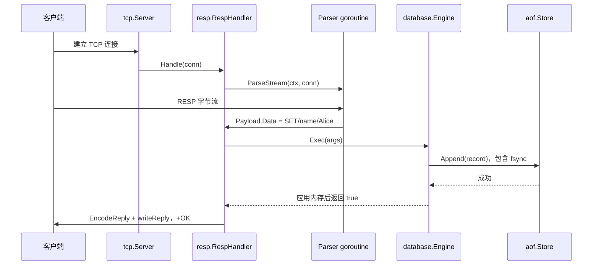

# MiniRedis 中文学习指南

这份指南对应本仓库当前代码。目标是先运行一个能用的服务，再沿着一条请求理解网络、协议、锁、过期、持久化和停机。完成范围是执行说明书的 **P1 MiniRedis S1–S6**；P2 AI 应用后端尚未实施，不是这个服务的一部分。

代码备注解释容易出错的设计原因；完整实施过程与实际验收见 [开发记录](notes.md)，性能原始数据见 [性能记录](performance.md)。学习问答的参考思路不等于你已经通过口述验收。

## 一、先运行，再阅读

需要 Go 1.26 或更高版本，运行平台目前为 Windows/Linux。下面命令从仓库根目录执行。本轮使用 Go 1.27.1；依赖都是 Go 标准库。`redis-cli` 是官方 Redis 客户端。本机没有独立安装它，本轮通过官方 Redis 容器中的 redis-cli 8.10.2 完成兼容性验收；下方直接客户端命令适用于已有独立客户端的环境，Docker 用法见第四节。

先检查环境和测试：

```powershell
go version
go test ./... -count=1 -timeout=60s
```

预期所有有测试的包出现 `ok`；`cmd/client` 没有测试。全包包含真实时间的 10 万 key 过期测试，需等待约十几秒。崩溃子进程的辅助测试在直接运行时会 SKIP，由外层 `TestThousandWritesSurviveForcedProcessTermination` 启动它，这个 SKIP 不表示外层恢复测试没运行。

窗口 A 启动服务：

```powershell
go run ./cmd/server -addr 127.0.0.1:6379 -aof data/appendonly.aof
```

预期打印启动和监听提示，进程持续运行。AOF 是 Append Only File，即顺序追加的操作日志，默认开启；该目录与文件不会进入 Git。想单独观察纯内存行为时，用 `-aof ""`。第二个服务占用同一端口会返回 listen 错误，而不会继续使用无效 listener。

窗口 B 运行官方客户端：

```powershell
redis-cli -p 6379 PING
redis-cli -p 6379 DEL learn:name learn:jobs learn:tmp
redis-cli -p 6379 SET learn:name Alice
redis-cli -p 6379 GET learn:name
redis-cli -p 6379 LPUSH learn:jobs a b c
redis-cli -p 6379 LRANGE learn:jobs 0 -1
redis-cli -p 6379 LPOP learn:jobs
redis-cli -p 6379 SET learn:tmp value
redis-cli -p 6379 EXPIRE learn:tmp 1
Start-Sleep -Seconds 2
redis-cli -p 6379 TTL learn:tmp
```

依次预期：PONG；DEL 返回 0–3（用于清理本示例 key）；OK；Alice；3；数组 c、b、a；c；OK；1；等待后 TTL 为 -2。`Start-Sleep` 是 PowerShell 命令，Linux shell 可改用 `sleep 2`。GET 缺失返回 nil，TTL 永久 key 返回 -1；尚未到期的 TTL 按最近整秒报告，显示 0 不一定已经删除。

在窗口 A 按 Ctrl+C，再用相同命令和 AOF 路径启动，GET learn:name 应为 Alice，LRANGE learn:jobs 0 -1 应为 b、a；learn:tmp 不应因为重启又获得一秒寿命。本轮已用实际主程序、独立隐藏控制台和 Windows CTRL_C_EVENT 自动完成信号退出/重开 AOF，String/List 保留、TTL 没有续命；以上官方客户端与手按键盘的操作仍作为学习练习。正常停止顺序和磁盘故障边界见第三节。

没有独立 redis-cli 时，也可运行已有的真实 TCP 测试；本轮官方容器客户端另行验收通过，不需要扩展学习客户端：

```powershell
go test ./tcp -run='TestTwentyCommandsOnOneConnection|TestTTLCommandsOnTCP' -count=1 -v
```

预期两个测试 PASS，前者在一条连接中发送 20 条 RESP 命令。它证明 TCP 路径行为，仍不等于官方客户端验收。`cmd/client` 是早期练习，尚不能正确显示完整数组，不用它判断 LRANGE 是否正确。

## 二、沿一条 SET 请求追踪

先解释三个词：TCP 是有序字节流，不保留每次 Write 的边界；RESP 是 Redis 的序列化协议，用类型前缀和长度分帧；handler 是每条连接的处理者，负责把解析、执行、编码串起来。

`SET name Alice` 的 RESP2 线格式如下，`\r\n` 表示两个真实字节，不是打印出来的反斜杠：

```text
*3\r\n$3\r\nSET\r\n$4\r\nname\r\n$5\r\nAlice\r\n
```

`*3` 表示三个参数；`$3` 表示下一个参数有三个字节。长度是字节数，中文 UTF-8 字节数不能用“汉字个数”代替。bulk 是按长度读取的字符串，内容可以含换行和零字节，因此保持二进制安全。



按这个顺序打开文件，不要一开始就阅读全部测试：

1. [cmd/server/main.go](../cmd/server/main.go) 的 `main` 与 `run`：读 flags，把信号转成 context，先占端口，创建 Engine，重放 AOF 后才 AttachLog，启动一个 TTL 清理工作，最后 Serve。
2. [tcp/server.go](../tcp/server.go) 的 `Serve`：Accept 接收连接，为每条连接启动 Handle。listener 是等新连接的对象，conn 是已经建立的连接，两者职责不同。
3. [resp/handler.go](../resp/handler.go) 的 `Handle`：注册连接，启动解析器，从 channel 收 Payload，执行 Exec，编码并写回。channel 是 goroutine 之间传递值的通道；goroutine 是 Go 调度的并发工作。
4. [resp/parser.go](../resp/parser.go) 的 `ParseStream`、`readRequest`、`readHeader`：循环拆完整请求，`io.ReadFull` 处理半包，读取下一条处理粘包。半包是一条帧只到一部分，粘包是多条帧一起到达，都属于正常 TCP 行为。
5. [database/engine.go](../database/engine.go) 的 `Exec` 和 [persistence.go](../database/persistence.go) 的 `executeWrite`、`prepareWrite`：命令名大写归一化，检查参数和类型，加分片锁，准备日志和内存动作，日志成功后才应用。
6. [aof/store.go](../aof/store.go) 的 `Append`：RESP 编码、循环处理短写、Sync。fsync 对应 Go 的 `File.Sync`，要求操作系统把写入同步到存储；它有等待成本，不能等同于硬件永不故障。
7. [resp/reply.go](../resp/reply.go) 的 `EncodeReply` 返回 `+OK\r\n`，handler 的 `writeReply` 写完全部字节。处理完这条命令后继续等同连接的下一条。

跟一条 GET 时，跳过 executeWrite/AOF：`Exec → get → lockRead → 复制结果 → EncodeReply`。复制是为了让返回后的调用者不能修改存储内部字节。String 缺失返回 `nil`，被编码为 `$-1\r\n`；List 的 LRANGE 返回 `[][]byte`，被编码为 RESP 数组。

自查：如果网络一次只送到 `Al`，是哪一步继续等待？答案是 `ReadFull`；如果一次送来两条 SET，哪一步拆成两个 Payload？答案是 ParseStream 的读请求循环；如果 SET 刷盘失败，能否先发 OK？答案是不可以，executeWrite 返回错误且不应用该次内存动作。

## 三、分模块理解关键取舍

### 协议与错误：先限制，再分配

请求上限在 `resp/parser.go`：1024 参数、单 bulk 16 MiB、头部 64 bytes（含 CRLF）、整条请求 32 MiB。`readHeader` 使用固定缓冲 ReadSlice，避免无换行输入让 ReadBytes 一直扩容；`readRequest` 在分配下一段之前计算整帧预算。单段上限不能代替总预算。

完整请求之外的干净 EOF 正常结束；半条请求的 EOF 是协议错误。handler 只回复固定 `ERR Protocol error`。业务错误在 `database/errors.go` 有公开 RESPError 字段和内部原因，`EncodeReply` 不回传内部错误链，还去掉公开消息中的 CRLF；这是稳定接口与错误信息隔离。

阅读后跑 `go test ./resp -run='TestParser|TestHandler|TestCommandReply' -count=1 -v`。重点对照超长无换行、负长度、截断、二进制、错误后连接行为，不只看正常 GET/SET。

### 分片锁与 List：并发安全也需要所有权

shard 是把 key 分成多组，每组持有一张 map 和 RWMutex。RWMutex 是读写锁：多个读者可并行，写者独占。`getShard` 使用 `fnv32(key) & (count-1)` 定位；count 必须是 2 的幂，不是任意整数。

`lockKeys` 对涉及的分片去重、排序后依次加锁。两个 DEL 以相反 key 顺序进入，也必须用相同锁顺序，否则可能互等形成死锁。SET、List 变更和过期元数据遵守同一分片锁；map 自身没有自动并发安全。

双向链表见 `LinkedList` / `Node`：LPUSH a b c 是依次头插，所以结果 c,b,a。LRANGE 的 stop 包含在区间内，-1 是最后一个，越界截取或返回空数组。EXISTS 重复 key 重复计数，DEL 重复 key 只计一次，不要把两者混淆。

输入、GET 和 LRANGE 的字节复制保护数据所有权；其代价体现在分配数据中。构造 64 分片不表示一定更快：[性能记录](performance.md) 的热点场景已测到更慢，不能只引用均匀负载。

### TTL：访问语义与内存回收是两件事

TTL 是 Time To Live，表示 key 的剩余寿命。`database/ttl.go` 保存的是 deadline（到期时间）。惰性删除在访问时检查，让过期 key 表现为不存在；主动删除由 `RunCleanup` 每 250ms、每分片最多随机检查 256 次，回收不再访问的冷 key。

`lockRead` 不能持着 RLock 再 Lock：先释放读锁，取写锁后重新检查。中间别的连接可能 SET/EXPIRE，省略重查会误删新值。`clearExpiration` 用末尾 key 补空位并更新索引，以 O(1) 删除；清空旧尾部引用帮助 GC（垃圾回收器）释放对象。

SET 覆盖后清 TTL；LPUSH/LPOP 保留存活 key 的 TTL，最后一个元素弹出会删除 key/期限。EXPIRE 非正数立即删除；TTL 为 -2 表示不存在，-1 表示无期限。实际 TCP 服务上的 5 秒 TTL 样本为 5 → 3 → -2，到期 GET 为 nil；永久 key 的 TTL 为 -1。

删除引用、GC 回收对象、操作系统归还内存页是三个步骤。最初 10 万 key 的活跃堆测试通过，但真实进程空闲 30 秒后工作集仍约 85.8 MB，只有约 12 KB 变化，不能据此称为实质回落。RunCleanup 现累计主动删除 32,768 个 key 后调用 debug.FreeOSMemory，两次至少间隔 5 秒，并且在所有分片锁释放后调用；这个函数会强制 GC 并尝试归还页，避免空闲进程缺少新分配时回收迟迟不发生。代价是全进程 GC 与归还页开销，不适合每 250ms 调用一次；取消 context 也不能打断已经进入的 GC。

修复后以真实主程序、无 AOF、10 万 key、每值 256 bytes、5 秒 TTL 测量，不再发送 GET/TTL，也不从外部强制 GC 或裁剪工作集。写完时工作集 82,616,320 bytes，15 秒后 25,841,664，30 秒后 25,829,376；Windows 工作集是当前驻留物理页计数，与 Go HeapAlloc 和 Private Bytes 都不同。该次回落约 69%，不保证回到启动内存，map/slice 容量仍可保留。阅读 [cleanup_test.go](../database/cleanup_test.go)：测试注入回收函数并验证分片锁已释放、取消后清理工作确实退出；真实工作集还需外部进程采样验证。

### AOF：确认边界与重放

`executeWrite` 选 **校验 → 追加 → fsync → 改内存 → 回复**。文件失败就不应用该次写入，Store 会尽力回滚到上次确认偏移并拒绝后续写入。期间保持分片锁，读者看不到未确认的内存变更；所有持久化写入还由 logMu 排序，代价是等待磁盘和写入串行化。

`Open` 使用同一个 Parser 重放；`Payload.BytesRead` 计算完整记录真正消费的字节，不能拿 bufio 预读量或重新编码长度代替。只有不完整尾部允许自动截断，完整损坏记录必须报告错误。操作系统独占文件锁避免两个进程同时写同一日志，进程退出会释放锁；Windows/Linux 实现在对应 lock 文件中。

EXPIRE 记录内部 `__EXPIREATMS` 绝对 Unix 毫秒期限，网络 Exec 不开放它，重启不会延长 TTL。已经返回成功的命令没有应用层缓冲丢失秒数；日志同步后、回复前崩溃时，客户端未确认的命令仍可能恢复，所以重试 LPUSH 不保证只执行一次。磁盘同步和回滚都失败时文件结果不确定，不能把 always-fsync 说成任何断电/损坏都安全。完整边界见 [README 崩溃窗口](../README.md#崩溃窗口)。

### 生命周期与停机：取消、关闭、等待分别负责什么

context 表示“请停止”，不自动杀死 goroutine，也不自动打断任意 Read。handler 的退出路径依次取消解析器、关闭连接、读到解析 channel 关闭，再 wg.Done；WaitGroup 用于确认工作实际退出。closed 与 wg.Add 同锁，避免开始 Wait 后还加入新工作。

`Server.Shutdown` 先关 listener。`RespHandler.Shutdown` 关闭闲置连接和半包等待，取消解析，不接收新命令，让已经开始的 Exec 写完回复再退出；解析器提前读到的流水线请求不算已经开始。主程序给连接排空 2 秒预算，再等待清理工作、同步并关闭 AOF。`Close` 是强制关闭接口，作用不同。

截止时间可以限制网络写入，不能强行取消任意执行器或文件 fsync。超时会明确返回 DeadlineExceeded，不能假装干净退出；极端存储卡死仍可能拖延最终 flush。普通取消＋AOF 重放、慢请求回复保留、超时返回和 goroutine 回收已自动验证。对实际主程序发送 Windows Ctrl+C 信号也已通过：独立隐藏控制台只包含测试辅助进程和本次服务，先核对 PID 才发信号，普通样本约 1.6–3.0ms 退出，退出码 0；退出后能重开 AOF 并读取已确认 String/List。没有向其他控制台或用户服务发送信号，也没有据该样本保证极端 I/O 下的三秒上限。

## 四、测试与调试路线

先定位层次，再跑窄范围；改变公共写路径、生命周期或协议后才跑全包回归。`-count=1` 禁用成功测试缓存，`-v` 显示具体测试，`-timeout` 防止等待逻辑挂住。

| 现象 | 先读/先跑 | 观察点 |
|---|---|---|
| 帧解析/异常输入 | `go test ./resp -run=TestParser -count=1 -v` | 帧长度、CRLF、半条 EOF、预算 |
| 命令结果不对 | `go test ./database -run='TestCommand|TestList|TestEngineOwns' -count=1 -v` | 参数、类型、顺序、别名 |
| 过期异常 | `go test ./database -run='TestTTL|TestExpired|TestCleanup|TestLargeExpiration|TestExpireHundred' -count=1 -timeout=60s -v` | 假时钟语义与真实清理分别验证 |
| 重启丢失或无法启动 | `go test ./aof -count=1 -timeout=60s -v` | 偏移、半条/完整坏记录、锁、同步失败 |
| 退出挂住或回复丢失 | `go test ./tcp ./resp ./cmd/server -run='Shutdown|ConcurrentClose' -count=1 -v` | 监听停止、当前命令、闲置连接、parser、AOF 释放 |

完整普通检查：

```powershell
go test ./... -count=1 -timeout=60s
go vet ./...
go build ./...
gofmt -l .
staticcheck ./...
```

预期测试/build/vet/staticcheck 成功；gofmt 输出为空。Staticcheck 是静态分析工具，最后一条适用于已安装工具的环境。本轮最终普通检查和已存在的 Staticcheck 已通过；不存在用文件编写代替测试的结论。

竞争检测 race 在运行时监测未受同步保护的共享访问，普通测试通过不能证明没有数据竞争：

```powershell
go test -race ./... -count=1 -timeout=180s
```

race 需要支持的 C 工具链，CGO_ENABLED=0 不能代替它。使用者明确同意后，本轮仅在测试子进程设置 CGO_ENABLED=1、CC 为已有便携 w64devkit GCC，并把其 bin 临时加入 PATH；没有改系统配置。内存回收修复后重新跑全量 race 通过：aof 3.877s、cmd/server 1.319s、database 15.274s、resp 1.397s、tcp 1.221s，无 DATA RACE 报告。完整命令、输出位置和工具缓存设置见开发记录末尾。

Fuzz 是自动生成大量输入来探索边界，不是随机发 Redis 业务命令：

```powershell
go test ./resp -fuzz=FuzzParseStream -fuzztime=10m -parallel=2
```

本轮 AOF 偏移改动后已经运行十分钟并通过，约 7915 万次执行。再修改解析器时需重跑；普通 `go test` 只运行种子，不等于十分钟 Fuzz。

Benchmark 测耗时和分配，pprof 对运行中的 CPU 样本归因：

```powershell
go test ./database -run='^$' -bench=BenchmarkEngine -benchmem -benchtime=2s -count=3 -cpu=16
go test ./database -run='^$' -bench='BenchmarkEngine/hot80/shards16$' -benchtime=10s -cpu=16 -cpuprofile=cpu.pprof -o=database-profile.test.exe
go tool pprof -top database-profile.test.exe cpu.pprof
```

并发 ns/op 是总耗时除总操作数，不是请求尾延迟。本轮 CPU profile 的前列包括 runtime.procyieldAsm、semawakeup、semasleep 和 Mutex.lockSlow，符合热点竞争/调度开销；不是专门的 mutex/block 等待 profile，不据它宣称已经测完全部等待时间。S5 的九格没有 TTL 后台清理，因此这些值也不包含新增主动 GC 的暂停成本，不能外推为大量过期时的服务尾延迟。

Docker/CI 的文件分别为 [Dockerfile](../Dockerfile) 和 [ci.yml](../.github/workflows/ci.yml)。Docker 多阶段构建用 Go 镜像编译，把纯 Go Linux 可执行文件复制到 scratch 空镜像，以非 root 用户运行，命名卷保存 /data。已有 Docker 环境可执行：

```powershell
docker build -t mini-redis:local .
docker run --rm --name mini-redis-local -p 127.0.0.1:6379:6379 -v mini-redis-data:/data mini-redis:local
```

随后从另一个窗口用 redis-cli 连接，停止可用 `docker stop --time 3 mini-redis-local`。本轮已有 Docker Desktop 启动成功，构建和官方客户端验收通过。客户端可用 `docker run --rm --network container:mini-redis-local redis:alpine redis-cli -h 127.0.0.1 -p 6379 PING`；无需为此再装系统客户端。20 条混合命令期间四次采样 TCP socket inode 与本地端口保持不变，覆盖小写 SET、多值 LPUSH/LRANGE、WRONGTYPE、TTL 和多 key。还验证了含零字节/CRLF/中文的二进制值、容器内 5 秒 TTL、Linux SIGKILL 后命名卷重放及 SIGTERM 约 0.294s 正常退出。专属临时资源已清理，Docker Desktop 与镜像保留。本次 [草稿 PR #1](https://github.com/Li-Nepenthe/mini-redis/pull/1) 的远端 race、vet、固定版本 Staticcheck、build 和格式检查已经全部通过；来源为 [CI 运行](https://github.com/Li-Nepenthe/mini-redis/actions/runs/36974612279)。这是审查分支的真实结果，main 仍未合并，不能把默认分支徽章也勾为完成。

## 五、按阶段练习与自查

每一轮先自己回答，再看参考思路。不要为了练习直接改真实 AOF；故障实验用测试临时目录或单独的数据文件。

| 阅读轮次 | 练习 | 自查问题与参考思路 |
|---|---|---|
| 1：TCP/RESP | 跑 ParserFragmentedInput 与 ParserMultipleCommands，画出帧边界 | 一次 Read 为什么不是一条命令？TCP 没有 Write 边界，按协议长度累积/拆分 |
| 2：命令/List | 执行混合大小写、LPUSH a b c、LRANGE -2 -1；再把同 key SET 成 String 后 LPUSH | 为什么得到 b,a？负下标从尾算；为什么 WRONGTYPE？已有 String 不能作为 List 更新 |
| 3：锁/所有权 | 阅读 TestEngineOwnsStoredAndReturnedBytes、ConcurrentListAndMultiKeyCommands | 为什么读值也拷贝？离锁后调用者可改切片；为什么多 key 排序？防止锁环 |
| 4：TTL | 阅读 TTLSemantics、ExpireHundredThousandKeysWithoutReads 与 LargeExpirationReclaimsOutsideShardLocks | 无 GET 为何也回收？主动抽样；空闲进程为何补主动 GC？删除引用不等于归还页；为什么限频并先放锁？降低全局 GC 和请求阻塞成本 |
| 5：AOF | 阅读 RecoverOnlyIncompleteTailWithActualOffsets、WriteAndSyncFailuresAreSticky | 哪条尾部能截断？仅不完整记录；写失败为何拒绝后续写？避免存储故障被掩盖；为何绝对 TTL？避免重启续命 |
| 6：停机/性能 | 跑 ShutdownDrainsInFlightReplyAndRejectsPipeline，读 hot80 表与 pprof | 为什么当前回复保留而下一条丢弃？明确开始边界；更多分片为何没优势？同 key 仍共用锁 |

封版的七项口述可用这些参考思路检查：

1. **TCP 粘包半包**：字节流与应用帧边界不同，ReadFull 和连续读请求各解决哪一类问题。
2. **RESP 解析**：数组参数＋bulk 长度、CRLF、二进制安全、分配前预算；请求子集与完整 Redis 协议的差别。
3. **分片锁**：hash 定位、RWMutex、固定顺序多锁；热点与全局 AOF 写序会限制并行。
4. **TTL 双策略**：惰性删除保证访问，主动抽样回收冷数据；避免每 key 定时器与全表长时间持锁。大批过期后的限频主动 GC 为什么放在分片锁外？HeapAlloc、工作集、map 容量为什么不能混用？
5. **AOF 崩溃窗口**：先日志后内存，已确认与未确认区别，绝对期限、半条尾部、fsync 成本与存储失败边界。
6. **goroutine 生命周期**：谁启动、谁取消、谁关闭阻塞 reader、谁等待；只发取消信号不等于已经回收。
7. **S1 修复的缺陷**：忽略 listen 错误会使用 nil listener；无换行头和过大的累计请求会制造无界内存压力；handler 提前返回而 parser 仍发送会泄漏。基线已经有负长度检查，不把已有工作算成这轮新增修复。

扩展练习先写设计/测试，再决定是否实现：如何加入更多 String 选项、如何测网络吞吐、如何测 mutex 等待、周期 fsync 会怎样改变确认窗口。缓存行伪共享是不同变量位于同一 CPU 缓存行而触发一致性竞争；本轮没有硬件证据证明它是瓶颈，不先猜测加 padding。AOF Rewrite、复制、Cluster、事务、Lua、Pub/Sub 与 P2 AI 后端属于后续范围，本轮没有自动实现。

## 六、当前证据与封版差距

已实现：十条命令、16 分片 String/List、TTL 双策略与大批过期限频回收、always-fsync AOF/重放/尾部恢复、context 停机与请求排空。已验证：修复后全量 race、普通引擎/协议/真实 TCP 测试、10 万 key 清理及实际进程工作集回落、真实 Windows Ctrl+C、1000 次已确认写入后强制终止恢复及实际文件半尾截断、存储故障、两轮十分钟 Fuzz、S5 九格及 CPU profile、最终 vet/build/Staticcheck/格式与 Linux 交叉构建。Windows TerminateProcess 覆盖不经过正常关闭的崩溃路径；本轮 Docker 中也通过原生 Linux SIGKILL 验证命名卷恢复。

官方 redis-cli、Docker build/run 和草稿 PR 的远端 CI 已通过。未验证：main 首页/默认分支徽章、用户脱稿口述。未用手按键盘代替自动信号测试；极端磁盘阻塞与大量过期时的请求尾延迟也没有测量。未实现：范围外 Redis 功能与 P2；AOF Rewrite 和全局内存/连接配额也没有。没有把“已有 CI/Docker 文件”当作“CI/Docker 通过”。

S1–S5 已完成当前工程验收，S2 官方客户端已补齐；S6 本地、Docker 与审查 PR CI 验收通过，main 首页/默认分支徽章与本人学习验收尚未闭合。实际日期不能替代说明书的全阶段完成特征；当前不能宣布封版。下一步应补齐上述环境/权限相关验收并由使用者做学习自查，已有结果的命令与限制以 [notes.md](notes.md) 为准。


## 复审补充：重放为何不能提前过期

阅读 persistence_test.go 的 TestReplayPreservesHistoricalExpiryAndCreation：比较同一操作历史在原引擎与重放后的 TTL/GET/LRANGE。历史 EXPIRE 的期限已经早于“现在”，后面仍可能出现当时尚未过期的追加或有效续期；重放必须先还原完整历史再判断最终期限。清理 worker 不向 AOF 写删除，所以新的 List 创建用 _LNEW 留下边界，既覆盖惰性删除也覆盖主动清理、原 String 过期后变 List。Replay 不重新 Append；这两种内部记录都不能经客户端 Exec 调用。

练习：先复现“LPUSH a→EXPIRE 1→LPUSH b→到期→重启”，再追踪“EXPIRE 5→第4秒 EXPIRE10→第6秒重启”。旧草稿日志没有新建边界，无法反推其中所有过期后重建；只读兼容不等于历史歧义被修复。工程范围和未验条件以 acceptance-matrix.md 为准，个人口述仍待自己学习。
